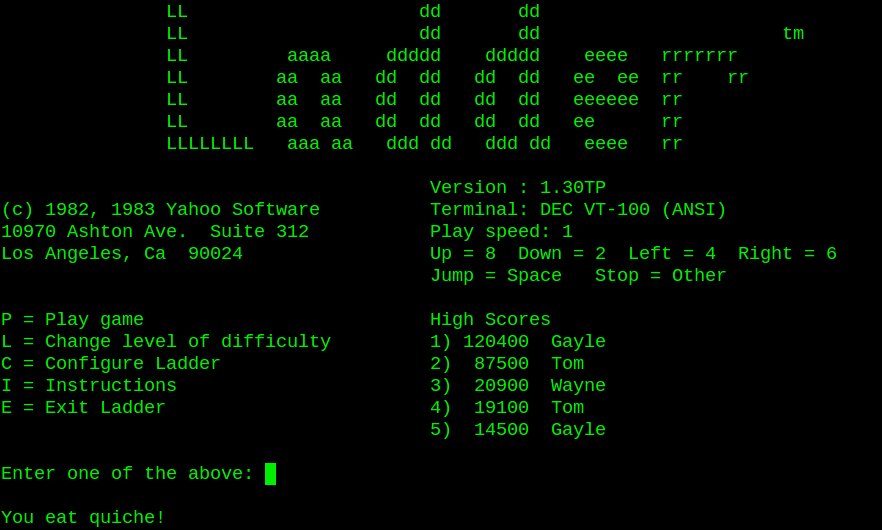
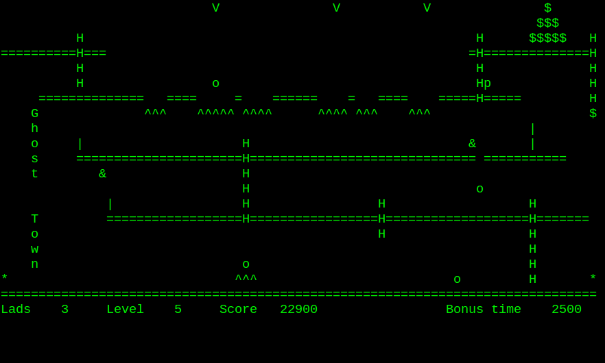

# Ladder
The classic CP/M game Ladder [reverse engineered in Turbo
Pascal](https://github.com/mecparts/Ladder) and then [ported to the Free
Pascal Compiler and ncurses](https://github.com/dcoshea/Ladder) for use
on (relatively modern) Linux, etc. systems.

#### This is a rewrite of the classic CP/M game "Ladder", originally written by Yahoo Software (not Yahoo!).

Ladder is an ASCII character based platform arcade game similar to 
Donkey Kong. You travel through levels with platforms and ladders 
where rocks fall down from the top while you collect statues 
before reaching the exit.

From https://github.com/mecparts/Ladder:
> Back in 1999 Stephen Ostermiller made a version of [Ladder in 
> Java](http://ostermiller.org/ladder/). Later, Mats Engstrom of 
> SmallRoomLabs started another version in of [Ladder in 
> golang](https://github.com/SmallRoomLabs/ladder). Between my own 
> memories of playing the original game on a Kaypro, and Stephen 
> Ostermiller's and Mats Engstrom's code, I was able to come up 
> with this version.

https://github.com/mecparts/Ladder uses the original `ladconf.com`
configuration program included in this repository to generate a
`LADDER.DAT` containing the required settings, plus some settings which
were ignored. For simplicity, this fork instead provides its own
internal configuration menu. No attempt has been made at this point to
mimic the appearance or behavior of `ladconf.com`, only to generate a
`LADDER.DAT` containing the required fields.

## Compiling the game

In the `src` directory, run `fpc ladder.pas`.  This has been tested
with FPC version 3.0.4.

If you don't have a `LADDER.DAT` file, when you run `ladder` the first
time, it'll display its internal configuration menu to set up the
movement keys and options, then display the main menu.

## Limitations

From https://github.com/mecparts/Ladder:
> At the moment, once you've successfully completed the 7th distinct level 
> (Gang Land), the program just cycles through all 7 seven levels over and
> over again until the bonus time becomes too short to actually finish a 
> level. If anyone knows what the original program actually did (I never 
> managed to get anywhere near to completing the original game), let me 
> know and I'll see what I can do.

## References

[Original Ladder game](http://www.classiccmp.org/cpmarchives/cpm/Software/WalnutCD/lambda/soundpot/f/ladder13.lbr) 
[Reverse-engineered Turbo Pascal version on which this is based](https://github.com/mecparts/Ladder)
[Ladder in Java](http://ostermiller.org/ladder/) 
[Ladder in golang](https://github.com/SmallRoomLabs/ladder) 

